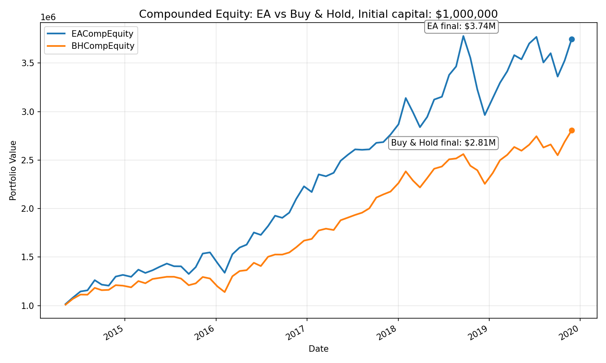

# Evolving Stock Trading System

This project implements an **evolutionary algorithm for evolving fuzzy trading rule bases** for stock selection and portfolio management.  
The system ranks stocks using fuzzy inference over technical indicators and trades them using a sliding window methodology.

The project was developed as part of the **Evolutionary Algorithms** course at **AGH University of Science and Technology**.

---

## Methodology

The approach is **inspired by** the paper:

> **Ghandar, A., Michalewicz, Z., Schmidt, M., Tô, T.-D., & Zurbrugg, R.**  
> *Evolving Trading Rules*  

The implementation follows the **general principles** proposed in the paper, while adapting and extending them for the stock market setting used in this project.  
In particular, the approach is **conceptually similar but not an exact replication** of the original work.

### Core Ideas Adopted from the Paper
- Representation of trading logic as a **fuzzy rule base**
- Use of an **evolutionary algorithm** to evolve rule parameters
- Evaluation using a **sliding window** (train–trade) framework
- Portfolio construction based on **relative ranking of assets**

### Differences from the Original Work
- Applied to a **selected universe of U.S. stocks**, rather than the original market studied in the paper
- Uses a **custom stock universe** and modern data sources
- Includes additional implementation details such as:
  - explicit transaction costs,
  - portfolio size constraints,
  - detailed trade logging and performance comparison

---

## Data

- **Universe of stocks**:  
  Selected from stocks with the **highest trading volume in 2012**.

- **Source**:  
  Kaggle dataset  
  **"9000 Tickers of Stock Market Data (Full History)"**  
  by *jakewright*  
  (via `kagglehub`)

- **Market data**:  
  Historical price and volume data retrieved using `yfinance`.

- **Benchmark**:  
  Equal-weight **Buy & Hold** strategy over the same stock universe.

---

## Evaluation

- Initial capital: **$1,000,000**
- Sliding window:
  - Training window: 120 trading days
  - Step size: 20 trading days
- Performance is compared against a Buy & Hold baseline.
- Transaction costs and portfolio size constraints are included.

An example comparison of compounded portfolio value is shown below:

---

## Project Structure

- `evolving_stock_trading_system.ipynb` – main notebook with implementation and experiments
- `runs/` – generated outputs (trade logs, CSVs, intermediate results)  
  *(ignored by Git, created automatically per run)*

---

## Notes

This project is **educational and research-oriented**, developed for an academic course.  
Results depend on hyperparameters, evaluation period, and transaction cost assumptions.
